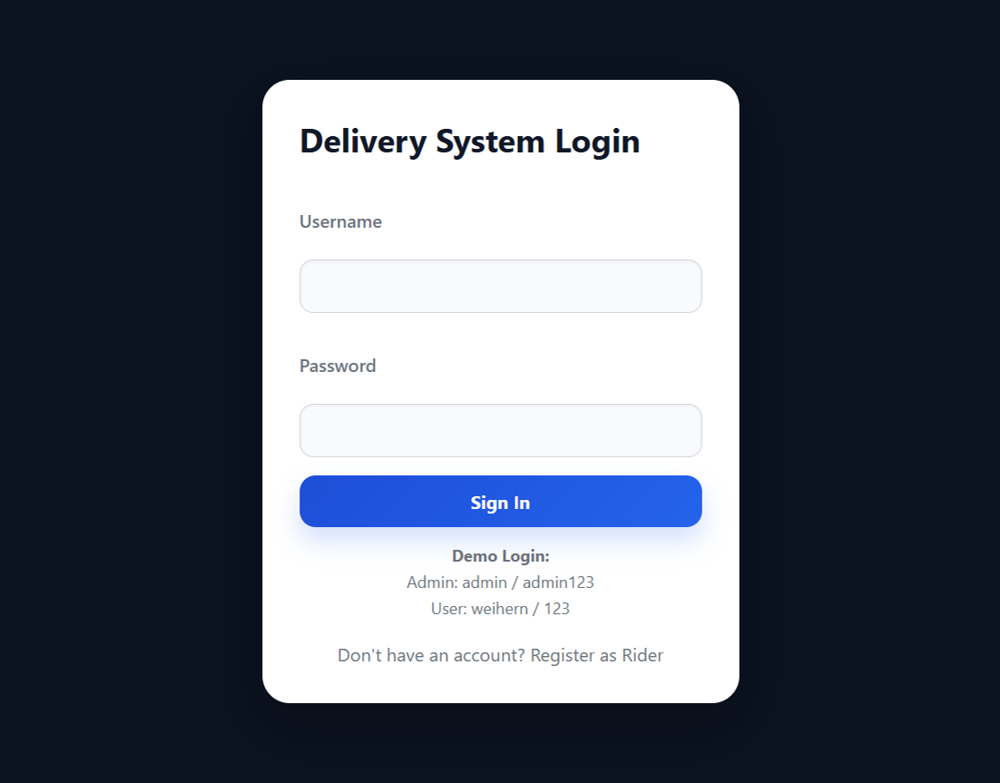
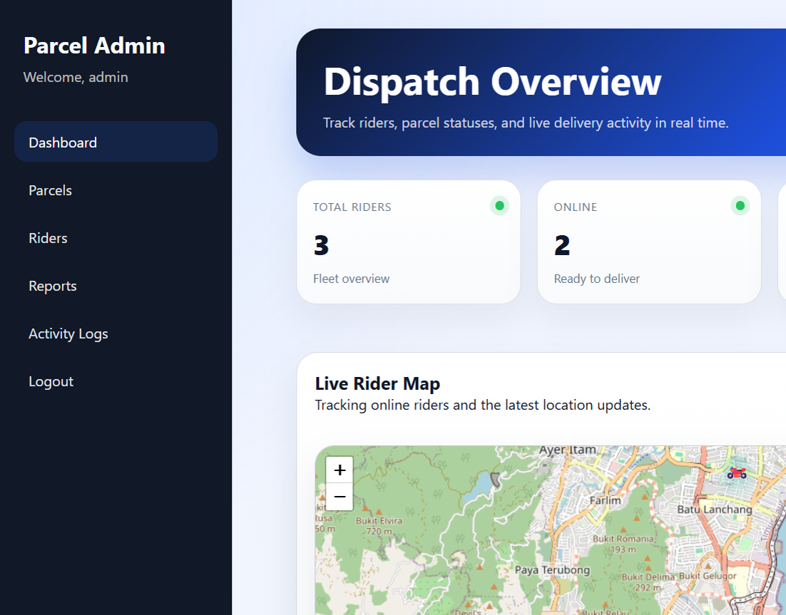
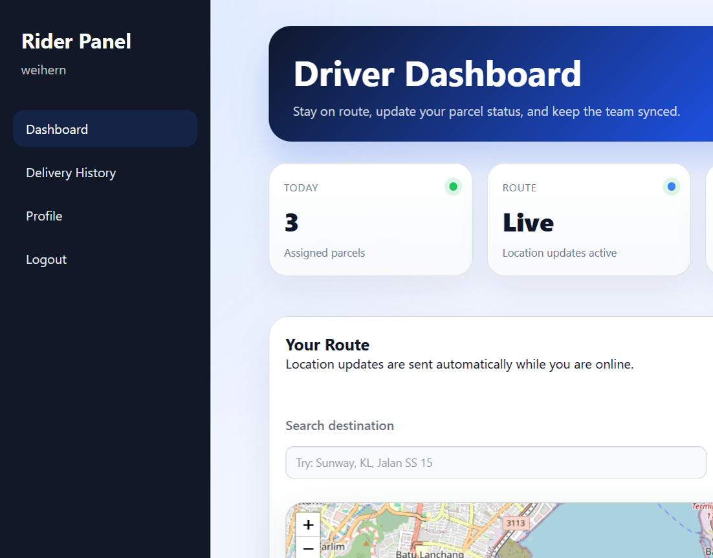
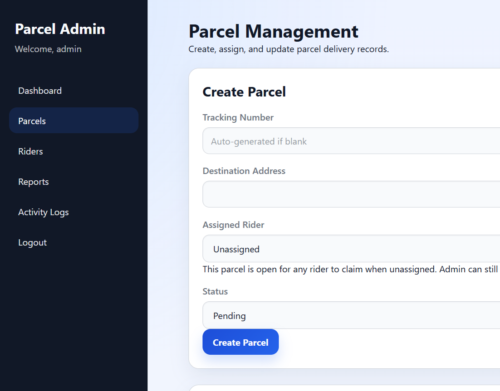

# Delivery System

一个基于 PHP + MySQL 的快递配送管理系统，支持管理员调度与骑手端配送，包含实时 GPS 追踪、包裹状态管理、送达凭证上传与报表统计。

A parcel delivery management system built with PHP and MySQL. It provides an admin dispatch console and a rider delivery portal with live GPS tracking, parcel lifecycle management, proof-of-delivery uploads, and reporting.


**在线演示 / Live Demo:** [https://weihern.kolejsynergy.com/Delivery-System/Delivery-System/](https://weihern.kolejsynergy.com/Delivery-System/Delivery-System/)

## 功能特性 / Features

- **双角色系统** — 管理员（Admin）与骑手（Rider）独立面板
- **实时地图追踪** — 基于 Leaflet + OpenStreetMap 显示骑手位置与路线
- **包裹全生命周期** — 待分配、配送中、已送达、配送失败
- **送达凭证** — 骑手可上传配送照片作为证明
- **报表与日志** — 配送汇总报表、系统活动日志
- **安全机制** — 密码哈希、CSRF Token、PDO 预处理语句

## 界面预览 / Screenshots

### 1. 登录页面 / Login

用户登录入口，支持管理员与骑手账号，骑手可通过注册页面创建账号。



### 2. 管理员调度面板 / Admin Dashboard

管理员可查看骑手总数、在线状态、已送达与待处理包裹，并在实时地图上追踪在线骑手。



### 3. 骑手配送面板 / Rider Dashboard

骑手可切换在线/离线状态、查看已分配包裹、搜索目的地，并自动上报 GPS 位置。



### 4. 包裹管理 / Parcel Management

管理员可创建、编辑、搜索包裹，分配骑手并更新配送状态。



## 技术栈 / Tech Stack

| 层级 | 技术 |
|------|------|
| 后端 | PHP 8+ |
| 数据库 | MySQL / MariaDB |
| 前端 | HTML, CSS, JavaScript |
| 地图 | Leaflet, OpenStreetMap |

## 快速开始 / Getting Started

### 环境要求

- PHP 8.0 或更高版本
- MySQL 5.7+ 或 MariaDB
- Apache（推荐 XAMPP）

### 安装步骤

1. **克隆仓库**

   ```bash
   git clone https://github.com/weihern08/Delivery_System.git
   cd Delivery_System
   ```

2. **配置数据库**

   ```bash
   cp config/database.example.php config/database.php
   ```

   编辑 `config/database.php`，填入你的数据库主机、库名、用户名和密码。

3. **导入数据库（可选）**

   应用首次运行时会自动创建表结构。你也可以手动导入：

   ```bash
   mysql -u root -p < sql/database.sql
   ```

4. **启动服务**

   将项目放到 Web 服务器目录（如 XAMPP 的 `htdocs`），启动 Apache 与 MySQL，然后访问：

   ```
   http://localhost/Delivery-System/index.php
   ```

5. **演示账号**

   | 角色 | 用户名 | 密码 |
   |------|--------|------|
   | 管理员 | `admin` | `admin123` |
   | 骑手 | `weihern` | `123` |

## 项目结构 / Project Structure

```
├── admin/          # 管理员页面（调度、包裹、骑手、报表、日志）
├── rider/          # 骑手页面（配送、历史、个人资料）
├── api/            # AJAX 接口
├── assets/         # CSS 与 JavaScript
├── config/         # 数据库配置
├── includes/       # 公共函数与布局
├── sql/            # 数据库结构
├── uploads/        # 配送凭证上传目录
└── docs/           # 文档与截图
```

## License

本项目采用 [MIT License](LICENSE) 开源协议。

Copyright (c) 2026 weihern08
